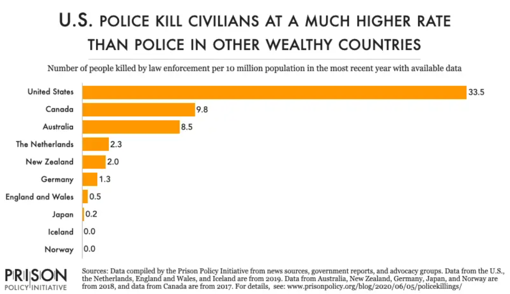
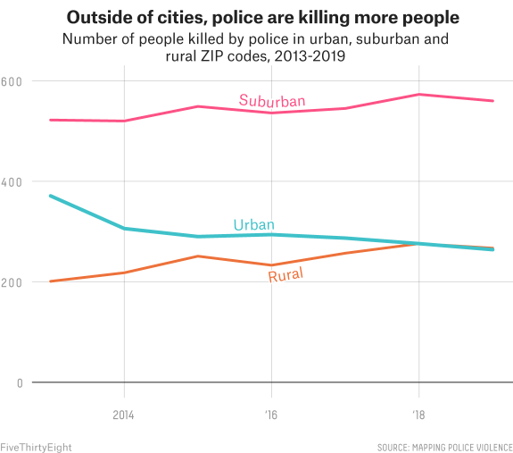

```{r setup, include=FALSE}
knitr::opts_chunk$set(echo = TRUE)
library(tidyverse)
library(readr)

options(scipen = 999)

killings <- read.csv("police_killings_MPV.csv") %>%
  select_if(function(x) all(!(is.na(x)))) %>%
  setNames(c("name", "age", "gender", "race", "url", "date", "address_of_incident", "city", "state", "county", "agency_responsible", "ORI_identifier", "cause_of_death", "description", "judgment_of_death", "criminal_charges", "article", "mental_illness", "armed_or_unarmed", "weapon", "threat_level", "fleeing", "bodycam", "offduty", "geography", "mpv_id"))

killings[killings == ""| killings == "Unknown" | killings == "Unknown race" | killings == "Undetermined"] <- NA
  
killings <- drop_na(killings, race|gender|age|geography)

killings$racenum <- killings$race

killings <- mutate(killings, racenum = case_when(racenum == "White" ~ 1, racenum == "Black" ~ 2, racenum == "Hispanic" ~ 3, racenum == "Native American" ~ 4, racenum == "Pacific Islander" | racenum == "Asian" ~ 5))

```

---

Police officers in the United States kill over three times the number of civilians per 10 million than police officers in other wealthy countries. [^1]  Over the past decade, police brutality has become a very political and divisive issue.  The victims of these cases, who are usually Black, draw national attention because their deaths draw into question the legality of the officer's actions and the legitimacy of using lethal force.  And the integrity of the police force is questioned for good reason; appalling flaws exist in this institution, namely discrimination and a lack of officer accountability.  Simply put, the US police force is becoming an increasing danger to the people and must be reformed, as the lack of accountability and pervasive discrimination within the system is disproportionately endangering the lives of US minorities, especially the Black community.



##### [Source: Prison Policy (Footnote 1)](https://www.prisonpolicy.org/blog/2020/06/05/policekillings/)

## Disparity in Deaths

The debate between the two major sides on police brutality over the past decade has stemmed from the question of whether Black Americans have a higher risk of dying from police interactions than other races.  One side of the debate says that all people are treated equally in the eyes of police, and any risk they have of being killed is caused by their own actions while interacting with an officer.  However, the other side says that American minorities, especially those who are Black, are more likely to be killed by police officers due to racial bias or discrimination.  But even with all that considered, what does the data say about it?  The dataset used[^2] to determine these trends is based on one compiled by Mapping Police Violence, an initiative whose information has been "meticulously sourced from the three largest, most comprehensive and impartial crowdsourced databases on police killings in the country: FatalEncounters.org, the U.S. Police Shootings Database and KilledbyPolice.net."[^3]

### Preliminary Data, Killings by Race
<div id="container">
  <div id="col1">
```{r killings_by_race, echo=FALSE}

#### Plot 1 ####

# Killings per Race, first plot, raw data of cases where race is known

killings %>%
  count(gender, race) %>%
  ggplot() +
  geom_tile(aes(x = gender, y = race, fill = n)) +
  labs(title = "Number of People Killed by Police by Race, Gender",
       x = "Gender", y = "Race", fill = "Number Killed")
```
  </div>
  <div id="col2">
```{r race_killings_percents, echo=FALSE}
#### Plot 2 ####

# Adjusted data, factoring in the population percentage each race holds.  Shows the real risk of death.

# Create the dataframe of our compressed data to help show frequencies of murder per race.
racenums <- table(killings$racenum) %>%
  as.data.frame() %>%
  rename(race = Var1, num = Freq) %>%
  # The values for race are temporarily the values of racenum, copies them over at this time.
  mutate(racenum = race) %>%
  # Mutates the race values back to strings.
  mutate(race = case_when(race == 1 ~ "White", race == 2 ~ "Black", race == 3 ~ "Hispanic", race == 4 ~ "Native American", race == 5 ~ "Asian/Pacific Islander")) %>%
  # Population % values provided by US Census Bureau.
  mutate(percents = c(0.601, 0.134, 0.185, 0.013, 0.061)) %>%
  # 328,239,523 is total estimated population in 2019.
  # Also provided by US Census Bureau.
  mutate(pop_percent = 328239523 * percents) %>%
  # Value as a percentage.
  mutate(percent_killed = (num / pop_percent) * 100)

# Number of males, females, and transgenders killed by police.  Taken from 
# separate command, was too difficult and time-consuming when attempting to read
# the values into the columns when calculated, due to the specific order of the rows.
racenums$num_male <- 
  c(2502, 1406, 1003, 89, 122)

racenums$num_female <-
  c(169, 49, 31, 5, 7)

racenums$num_transgender <-
  c(4, 3, 0, 0, 0)

# Percentage calculations for each gender
racenums <- 
  mutate(racenums, percent_male = (num_male / pop_percent) * 100) %>%
  mutate(racenums, percent_female = (num_female / pop_percent) * 100) %>%
  mutate(racenum, percent_transgender = (num_transgender / pop_percent) * 100)


# Plot of the percentage of each race killed, split by gender.  Factored by percentage killed by race.
race_order <- c("Black", "Native American", "Hispanic", "White", "Asian/Pacific Islander")

ggplot(racenums) +
  geom_point(aes(x = factor(race, race_order), y = percent_male), color = "#FD6241") +
  geom_line(aes(x = factor(race, race_order), y = percent_male, color = "#FD6241"), group = 1) +
  geom_point(aes(x = factor(race, race_order), y = percent_female), color = "#FDC041") +
  geom_line(aes(x = factor(race, race_order), y = percent_female, color = "#FDC041"), group = 1) +
  geom_point(aes(x = factor(race, race_order), y = percent_transgender), color = "#41FDC0") +
  geom_line(aes(x = factor(race, race_order), y = percent_transgender, color = "#41FDC0"),  group = 1) +
  labs(title = "% Population Killed by Police by Race, Gender (2013-2020)", x = "Race", y = "% of Population Killed") +
  scale_colour_manual(name = "Gender", values = c("#FD6241" = "#FD6241", "#41FDC0" = "#41FDC0", "#FDC041" = "#FDC041"), labels = c("Transgender", "Male", "Female"))
```
  </div>
</div>

Looking into only the total numbers of police killings themselves presents a false narrative at face value.  Observing these totals, it is shown that White Americans are killed most often, and one would think they hold the highest risk of death by a police officer.  However, we want to see the percentage risk that a person has of dying depending on their race, not the frequency of each race's deaths.  White Americans are a majority of the US population, making up 60.1% of the US population[^4], so they naturally have the highest death count.  

Risk is better determined by examining the number of deaths compared to each race's entire population.  When observing the data in this way, almost all American minority groups have a higher death rate by police than those who are White.  Specifically, Black Americans have around three times the risk of dying by the police than white Americans do.  This puts way more credence into the opinion that Black people are discriminated against by the police.  However, it doesn't address the arguments for why exactly that happens.  They could be more hostile towards police most often out of all races, or they could be discriminated against by the police themselves.  But, our dataset provides information on the amount of people attacking police officers versus those who aren't when killed, which is exactly what is needed to prove if discrimination is present.
 
```{r geography, echo=FALSE, warning=FALSE}

# Simplifies judgment_of_death column for graph readability
killings <-  
  # Changes judgment of death column to be more generic
  mutate(killings, judgment_of_death = case_when(str_detect(judgment_of_death, "Pending") ~ "Pending", str_detect(judgment_of_death, "Charged") ~ "Charged", str_detect(judgment_of_death, "Justified") ~ "Justified", str_detect(judgment_of_death, "Administrative") ~ "Administrative", str_detect(judgment_of_death, "Grand") ~ "Grand")) %>%
  # Adds a new column for year to make faceting in later graph easier
  mutate(year = case_when(str_detect(date, "2013") ~ "2013", str_detect(date, "2014") ~ "2014", str_detect(date, "2015") ~ "2015", str_detect(date, "2016") ~ "2016", str_detect(date, "2017") ~ "2017", str_detect(date, "2018") ~ "2018", str_detect(date, "2019") ~ "2019", str_detect(date, "2020") ~ "2020"))


# Creates table of threat level by race
threat_level_race <-
  killings %>%
    group_by(racenum) %>%
    distinct() %>%
    count(threat_level) %>%
    mutate(race = case_when(racenum == 1 ~ "White", racenum == 2 ~ "Black", racenum == 3 ~ "Hispanic", racenum == 4 ~ "Native American", racenum == 5 ~ "Asian/Pacific Islander"))

# Creates table of frequency that each race attacks police when killed
attack_rate <- 
  threat_level_race %>%
    filter(threat_level == "attack") %>%
    rename(attack_num = n)

# Sends a group warning, suppressing it for RMD's sake.
suppressMessages(
attack_rate$total_n <- 
  threat_level_race %>%
    group_by(racenum) %>%
    summarise(sum(n))
)

# Adding columns for percentage values representing each race attacking vs. not attacking police
attack_rate <-
  attack_rate %>%
    mutate(percent_attack = attack_num / total_n) %>%
    mutate(percent_not_attacking = 1 - percent_attack)

# Makes table values readable without haveing to access multiple columns for one axis
attack_rate_long <-
  attack_rate %>%
  pivot_longer(c(percent_attack, percent_not_attacking), names_to = "name", values_to = "value")


# Order columns in plot in decreasing order
killing_percent_order <- c("Asian/Pacific Islander", "White", "Black", "Hispanic", "Native American")

# Creation of plot judging rate of attack when killed by race
attack_rate_long %>%
  ggplot() +
    geom_col(aes(x = factor(race, killing_percent_order), y = value$sum, fill = name), position = "dodge") +
  labs(title = "% of Civilians Attacking Officers vs. Not Attacking when Killed, by Race", x = "Race", y = "% of Total") +
  scale_fill_discrete(name = "% of Population", labels = c("Attacking Officer", "Not Attacking"))


View(killings)
```

The resulting findings from this plot completely contradict the idea that Black Americans have a larger amount of hostility towards police officers.  In the cases that these civilians are killed, Black people attack police officers less often than White people, yet their death rate is almost three times as high.  That leads to the only logical conclusion that the police system is leading towards discrimination against Black people.

## Discrimination

Throughout the history of the US, police have been tied to racist administrations.  In fact, "Slave patrols were among the first public policing organizations formed in the American colonies."[^5]  It doesn't just affect the Black population, however.  From 1882 to 1888, the police were responsible for upholding the Chinese Exclusion Act and the Scott Act, which "simultaneously barred Chinese people in the United States from naturalization and encouraged continued abuse of Chinese workers."[^6]  As for modern times, the FBI released an unredacted report in 2015, labeling white supremacists as one of the most dangerous groups within the country, due to the ties they have to members of police departments nationwide.[^7]  Police across the country have historically held positions that garner racism and discrimination, often times due to the administrations in state or federal government that they follow indiscriminately.  This loyalty to uphold positions that endanger the lives of specific race groups is not only blatantly racist, but it also shows the lack of accountability that runs rampant within the police system to this very day.

## Police Accountability

US police departments have shown a complete lack of accountability throughout the country's existence, which can be seen most obviously by the discrimination and racism that has pervaded the system.  However, this trend has seen positive developments within urban cities over the past seven years due to reforms to use-of-force policies, new police accountability systems, and better training.[^8] 



##### [Source: FiveThirtyEight](https://fivethirtyeight.com/features/police-are-killing-fewer-people-in-big-cities-but-more-in-suburban-and-rural-america/)

With these changes, police have actually killed less civilians each year in cities such as Dallas and Phoenix.  This trend is the sole positive one out of urban, suburban, and rural areas; the latter two have actually seen increases in deaths over the same timespan.  It's clear that reformations are helping to alleviate the deaths and pain caused not only to the Black community and minorities, but to everyone in the country.  If we want this trend to continue, we must ensure that the changes seen in urban America are put into place nationwide; so that everyone, no matter their race, can feel safe and not afraid of the police officers who serve their communities.


# Dataset Information

[My dataset](https://www.kaggle.com/jpmiller/police-violence-in-the-us) was present on Kaggle, where it was compiled and made more readable from the [dataset on Mapping Police Violence](https://mappingpoliceviolence.org/) pertaining to police killings since 2013.  Mapping Police Violence obtained their data from three sources: FatalEncounters.org, the U.S. Police Shootings Database and KilledbyPolice.net, as referenced earlier in the paper.  This dataset contained data of every known police killing from January 1st, 2013 to August 30th, 2020 as of the creation of this paper.


---

[^1]: [Prison Policy Initiative, "Not just 'a few bad apples': U.S. police kill civilians at much higher rates than other countries."](https://www.prisonpolicy.org/blog/2020/06/05/policekillings/)

[^2]: [Police Violence & Racial Equity - Part 1 of 3, Retrieved from Mapping Police Violence Data (Dataset).](https://www.kaggle.com/jpmiller/police-violence-in-the-us)

[^3]: [Mapping Police Violence, About the Data.](https://mappingpoliceviolence.org/aboutthedata)

[^4]: [United States Census Bureau QuickFacts.  Race, Population, and Sex Data.](https://www.census.gov/quickfacts/fact/table/US/RHI725219#RHI725219)

[^5]: [Brennan Center for Justice, Michael German, "Hidden in Plain Sight: Racism, White Supremacy, and Far-Right Militancy in Law Enforcement."](https://www.brennancenter.org/our-work/research-reports/hidden-plain-sight-racism-white-supremacy-and-far-right-militancy-law)

[^6]: [The New Republic, "The Echoes of Chinese Exclusion."](https://newrepublic.com/article/149437/echoes-chinese-exclusion)

[^7]: [FBI, Counterterrorism Division, Counterterrorism Policy Directive and Policy Guide, 89.](https://assets.documentcloud.org/documents/3423189/CT-Excerpt.pdf)

[^8]: [FiveThirtyEight, Samuel Sinyangwe, "Police Are Killing Fewer People In Big Cities, But More In Suburban And Rural America."](https://fivethirtyeight.com/features/police-are-killing-fewer-people-in-big-cities-but-more-in-suburban-and-rural-america/)
